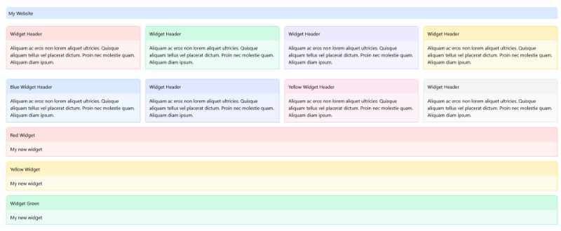

# Read Me
Minify-Sass was a challenge for myself to generate a Tailwind CSS file from a Sass file. Then it will generate a Tailwind CSS file to be exported as a default.css. It will purge all unused classes. I wanted to see if I could chain up a series of npm commands to create a CSS file. I did, yay!

## npm commands

Those commands can be found in the package.json file.

## Primary command

This command chains up other npm commands and will run one after the other. There is no error handling set up.

```npm run css-gen``` - This is the primary command where it will chain up npm commands and run them; npm run sass-default and npm run tailwind-prod.

## Secondary commands

Those commands can be used on its own. Useful if you need to test changes.

```npm run sass-default``` - This will only generate a Tailwind CSS file from the Sass CSS file. You can use it to check your updates.

```npm run tailwind-dev``` - This will export a default.css stylesheet based on the Tailwind CSS file. It won't purge any unused classes, resulting in a larger filesize. It use the tailwind.toggle.config.js file to check if the purge parameter was provided. In this case, this npm is not set up with such as a parameter.

```npm run tailwind-prod``` - This will export a default.css stylesheet based on the Tailwind CSS file. It will purge any unused classes, resulting in a smaller filesize. It use the tailwind.toggle.config.js file to check if the purge parameter was provided. In this case, this npm is  set up with a parameter i.e. "--purge=true". Review the package.json file for more info.
 
## Webpage
You can see the results of the generated CSS file in the "website" folder. You can review the index.html to see new CSS changes.


